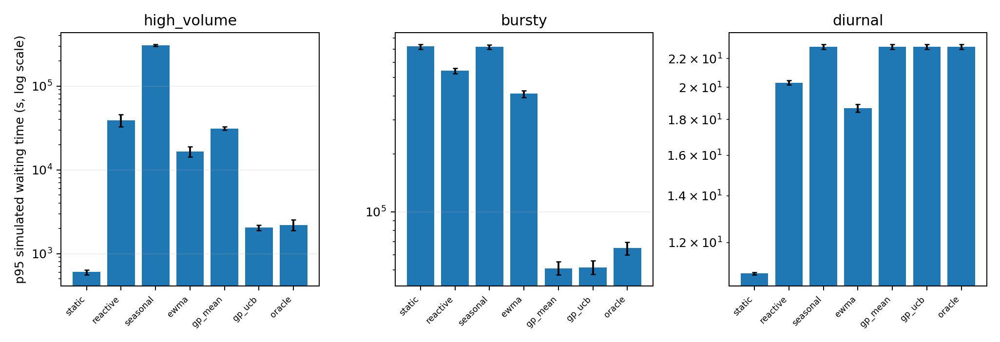
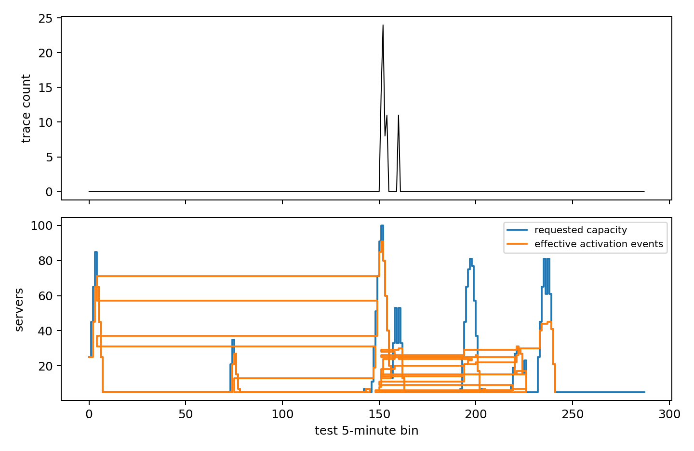
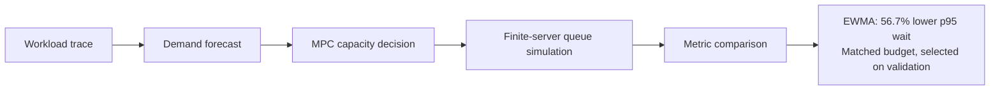

# Mean-Field Model Predictive Control for Serverless Workloads

## 日本語

本プロジェクトは、バースト性のある本番由来サーバーレス負荷に対する容量制御を評価する、独立したシミュレーション研究です。Gaussian Process による需要予測、mean-field キューモデル、有限台数サーバーのキューシミュレーションを組み合わせています。Docker を使って解析環境を再現できます。




**要約:** high-volumeシナリオでは、EWMA MF-MPCはreactive制御と比べて、シミュレーション上のp95待ち時間を56.7%削減しました（95% paired bootstrap CI: 52.8%–60.6%）。これは制御シミュレーションの結果であり、本番環境のレイテンシ測定ではありません。

### 担当範囲

個人プロジェクトとして、再現可能な解析パイプラインを設計・実装しました。トレースの前処理とシナリオ適格性判定、因果的な需要予測、mean-field容量制御、有限台数JSQキューシミュレーション、seedを対応させた評価、成果物に基づくレポート生成を担当しています。また、train/validation/testの分離とvalidationデータだけを使ったリソース予算の調整手順を定めました。結果の根拠は[主張と根拠の一覧](docs/CLAIMS.md)を参照してください。

### 主な結果

| シナリオ | コントローラーと比較対象 | p95シミュレーション待ち時間の変化 | 95% paired bootstrap CI | 平均リソース使用率（方式と比較対象） | 予算比較 |
|---|---|---:|---:|---:|---|
| High-volume | EWMA MF-MPC 対 reactive | 56.7%削減 | 52.8%～60.6% | 0.274 対 0.273 | 一致（validation基準で2%以内） |
| High-volume | GP-UCB MF-MPC 対 reactive | 94.4%削減 | 93.5%～95.3% | 0.758 対 0.273 | **不一致**。記述的結果のみ |
| High-volume | GP-UCB MF-MPC 対 GP-mean MF-MPC | 93.5%削減 | 93.0%～93.8% | 0.758 対 0.383 | **不一致**。記述的結果のみ |
| Bursty | GP-UCB MF-MPC 対 GP-mean MF-MPC | 2.5%増加 | 14.8%削減～8.9%増加 | 0.124 対 0.117 | 不一致。CIは差なしを含む |

リソース使用率はtestデータでの平均値です。予算一致の判定にはvalidationデータのみを使いました。各比較は10個の対応seedに基づきます。削減率は、比較対象のp95待ち時間を基準に `(比較対象 − コントローラー) / 比較対象 × 100` で算出しています。これらはAzure Functionsのレイテンシ測定でも、Azureのautoscalerの評価でもありません。負荷形状は公開Azure Functionsトレースに由来し、生データはリポジトリに含めていません。

### 負荷と容量制御の動作イメージ

下図は、代表的なhigh-volume負荷の5分ごとの到着数と、テスト区間でコントローラーが要求した容量・有効化イベントを示します。負荷が急増した区間で要求容量が変化し、起動遅延を経て有効化イベントが発生する様子を確認できます。下段の曲線はサーバー数と有効化イベントであり、待ち行列長の時系列ではありません。



キュー側の結果は、[コントローラー別p95待ち時間の図](figures/png/fig08_primary_controller_results.png)と、成果物の `results/queue_length_distribution.csv` にある到着時点のキュー長分布として示しています。現在の保存図には時間に沿ったキュー長の推移は含まれていません。

### 再現方法

Docker DesktopとComposeが必要です。リポジトリのルートで次を実行してください。

```powershell
docker compose build research
docker compose run --rm research uv run python -m mfcontrol reproduce --profile paper
```

再現コマンドは公開トレースを無視対象の `data/raw/` にダウンロードし、`data/processed/` に前処理データ、`results/` と `figures/` に結果を生成します。詳しくは[再現性メモ](docs/REPRODUCIBILITY.md)と[研究プロトコル](docs/RESEARCH_PROTOCOL.md)を参照してください。

### 範囲と制約

本プロジェクトは独立した計算研究であり、査読済み論文でも、本番環境への導入評価でもありません。再構成した呼び出し需要のイベント時刻は、ユーザーリクエストの実測到着時刻ではありません。mean-fieldキューモデルは理想化した制御モデルであり、Azure内部の挙動を示すものではありません。詳しくは[制約](docs/LIMITATIONS.md)と[方法上の変更点](docs/DEVIATIONS.md)を参照してください。

### ライセンスと引用

コードは[MIT License](LICENSE)で公開しています。引用情報は[CITATION.cff](CITATION.cff)にあります。

## English

An independent, Docker-reproducible simulation study of capacity control for bursty, production-derived serverless workloads. It combines Gaussian-process demand forecasting, a mean-field queueing model, and finite-server queue simulation.




**At a glance:** high-volume EWMA MF-MPC reduced p95 simulated waiting by 56.7% versus reactive control at a matched resource budget (95% paired bootstrap CI: 52.8%–60.6%). This is a controlled simulation result, not a production latency measurement.

## My contribution

This is an independent project. I designed and implemented the reproducible analysis pipeline: trace preprocessing and scenario eligibility, causal forecasting, mean-field capacity control, finite-server JSQ queue simulation, paired-seed evaluation, and artifact-backed reporting. I also defined the train/validation/test separation and validation-only resource matching protocol. Results are generated from saved machine-readable artifacts; see [claims and evidence](docs/CLAIMS.md).

## Selected findings

| Scenario | Controller vs comparator | p95 simulated waiting change | 95% paired bootstrap CI | Mean resource fraction (controller vs comparator) | Budget comparison |
|---|---|---:|---:|---:|---|
| High-volume | EWMA MF-MPC vs reactive | 56.7% reduction | 52.8% to 60.6% | 0.274 vs 0.273 | Matched (validation criterion: within 2%) |
| High-volume | GP-UCB MF-MPC vs reactive | 94.4% reduction | 93.5% to 95.3% | 0.758 vs 0.273 | **Unmatched**; descriptive only |
| High-volume | GP-UCB MF-MPC vs GP-mean MF-MPC | 93.5% reduction | 93.0% to 93.8% | 0.758 vs 0.383 | **Unmatched**; descriptive only |
| Bursty | GP-UCB MF-MPC vs GP-mean MF-MPC | 2.5% increase | 14.8% reduction to 8.9% increase | 0.124 vs 0.117 | Unmatched; CI includes no difference |

Resource fractions shown are test-set means; the budget-match decision was made using validation data only. Each comparison uses 10 paired seeds. The percentage is the paired per-seed p95 simulated waiting-time reduction, calculated as 100 × (comparator − controller) / comparator. Full precision and evidence sources are in [the claims ledger](docs/CLAIMS.md).

These are simulation results, not measurements of Azure Functions latency or evaluations of Azure's autoscaler. Workload shapes are derived from a public Azure Functions trace; raw data are not included.

## Workload and capacity-control trace

The figure below shows arrivals per five-minute bin for a representative high-volume workload, alongside requested capacity and effective activation events during the test interval. It illustrates capacity actions and activation delay around changes in load. The lower panel shows server counts and activation events; it is not a time series of queue length.


Queue outcomes are shown in the [controller p95 waiting-time figure](figures/png/fig08_primary_controller_results.png) and in `results/queue_length_distribution.csv`, which records queue-length distributions at job arrival. The saved figures do not currently include a time-series plot of queue length.

## Reports

- [English report (PDF)](paper/report.pdf)
- [日本語レポート (Markdown)](paper/report_ja.md)
- [Claims and evidence](docs/CLAIMS.md)

## Reproduce

Requires Docker Desktop with Compose. From the repository root:

```powershell
docker compose build research
docker compose run --rm research uv run python -m mfcontrol reproduce --profile paper
```

The reproduction command downloads the public trace into ignored `data/raw/`, preprocesses it into ignored `data/processed/`, and writes results and figures. See [reproducibility notes](docs/REPRODUCIBILITY.md) and [research protocol](docs/RESEARCH_PROTOCOL.md) for details.

## Scope and limitations

This project is an independent computational study, not a peer-reviewed publication or deployment evaluation. Reconstructed invocation-demand event times are not measured user-request arrival times. The mean-field queue model is an idealized controller model and is not a claim about Azure's internal behavior. See [limitations](docs/LIMITATIONS.md) and [methodological deviations](docs/DEVIATIONS.md).

## License and citation

Code is released under the [MIT License](LICENSE). Citation metadata is in [CITATION.cff](CITATION.cff).
